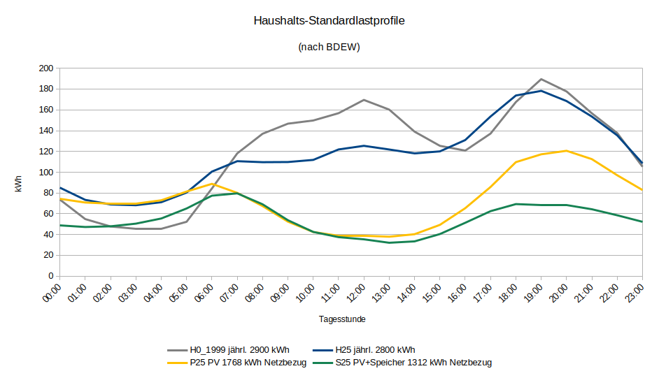
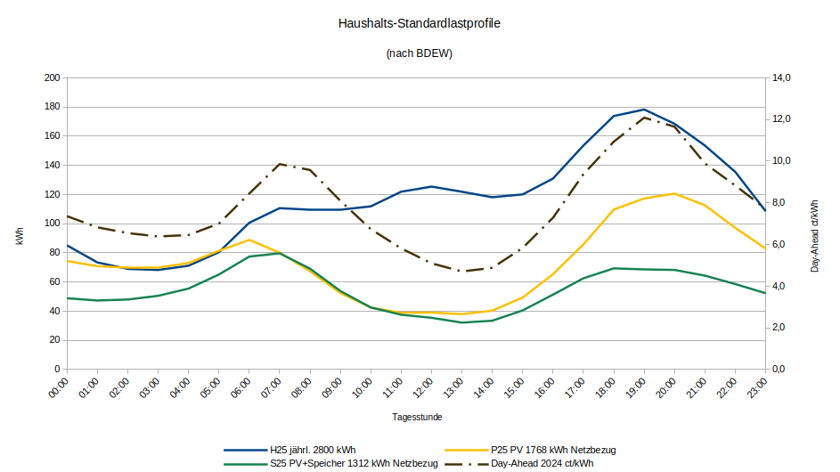
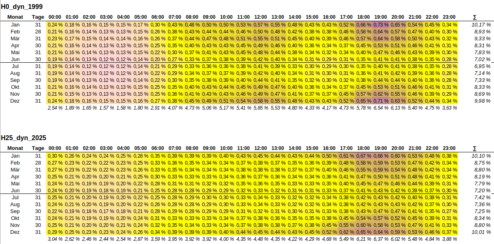

# Visualisierung von SLP/Standardlastprofilen

Dies sind Ableitungen der Daten der Standardlastprofile für Haushalte [des BDEW](https://www.bdew.de/energie/standardlastprofile-strom/).

Dabei werden das "alte" H0-Profil und die neueren verglichen.

Hintergründe zu den Profilen unten am Ende.
    
Ich habe diese Profile exemplarisch für das Jahr 2025 dynamisiert. (Siehe z.B. `data-exported\h25_dyn_2025_stdlich.csv`).

## Vergleich der Profile

Dabei ergibt sich die Schwierigkeit der Normung, also welchen Verbrauch will man darstellen? Die Solarprofile haben Eigenverbrauch und verringerten Netzbezug. Ich habe dazu die "schwächsten Solartage", also m.E. 12.12. - 30.12. genommen und versucht, die Profilnormung derart anzupassen, dass in diesem Zeitraum etwa ähnlich verbraucht wird.

Das Ergebnis finde ich ganz spannend: Es fand in den 25 Jahren zwischen dem H0-1999 und dem H25 eine Lastverschiebung statt, weg von der Mittagszeit. Warum die Last in den frühen Morgenstunden steigt, weiß ich nicht. Mehr Stromheizungen in den Daten?
Es bleiben ein Abend- und ein Morgen-Peak.

Die PV bringt den Mittagsverbrauch runter, die Batterien zusätzlich den Abendverbrauch. Jedoch haben merkwürdigerweise viele weiterhin diesen Morgen-Peak, trotz Batterien.

## Berechnung der Bezugskosten

Mit den Day-Ahead Preisen pro Stunde für das Jahr 2024

| ct/kWh         | 00:00 | 01:00 | 02:00 | 03:00 | 04:00 | 05:00 | 06:00 | 07:00 | 08:00 | 09:00 | 10:00 | 11:00 | 12:00 | 13:00 | 14:00 | 15:00 | 16:00 | 17:00 | 18:00 | 19:00 | 20:00 | 21:00 | 22:00 | 23:00 |
|----------------|-------|-------|-------|-------|-------|-------|-------|-------|-------|-------|-------|-------|-------|-------|-------|-------|-------|-------|-------|-------|-------|-------|-------|-------|
| Day-Ahead 2024 | 7,4   | 6,8   | 6,5   | 6,4   | 6,5   | 7,0   | 8,4   | 9,9   | 9,6   | 8,1   | 6,7   | 5,8   | 5,1   | 4,7   | 4,9   | 5,8   | 7,3   | 9,4   | 10,9  | 12,1  | 11,7  | 9,9   | 8,8   | 7,7   |

habe ich die Netzbezugsmengen (aus dem Profilvergleich, siehe Kapitel vorher) multipliziert, um die Beschaffungskosten (exkl. Grundgebühren/Netzkosten) zu ermitteln:

|                                  | EinkaufskostenGesamt | Durchschnitt/kWh | Menge kWh |
|----------------------------------|----------------------|------------------|-----------|
| Cost für H0 bei Day-Ahead        | 234 €                | 0,081 €          | 2900      |
| Cost für H25 bei Day-Ahead       | 228 €                | 0,082 €          | 2800      |
| Cost für Restmenge P25 Day-Ahead | 149 €                | 0,084 €          | 1768      |
| Cost für Restmenge S25 Day-Ahead | 108 €                | 0,082 €          | 1312      |

Das hat mich schon umgehauen. Die Restmengen bei PV und PV+Speicher unterscheiden sich so wenig, dass die durchschnittlichen Bezugskosten pro kWh fast identisch sind! ( Umkehrschluss - falls bei diesen Mengen zulässig: mit Speicher gelingt es nicht, von den Stunden mit billigen Preisen zu profitieren ).

## H25 Stunden-Verbrauchs-Koeffizienten

Das sind die Anteile an 1 MWh Jahresverbrauch für einen H25-SLP-Haushalt bezogen auf 2025:

| Monat | Tage | 00:00  | 01:00  | 02:00  | 03:00  | 04:00  | 05:00  | 06:00  | 07:00  | 08:00  | 09:00  | 10:00  | 11:00  | 12:00  | 13:00  | 14:00  | 15:00  | 16:00  | 17:00  | 18:00  | 19:00  | 20:00  | 21:00  | 22:00  | 23:00  |
|-------|------|--------|--------|--------|--------|--------|--------|--------|--------|--------|--------|--------|--------|--------|--------|--------|--------|--------|--------|--------|--------|--------|--------|--------|--------|
| Jan   | 31   | 2933,9 | 2516,9 | 2367,7 | 2334,1 | 2416,1 | 2703,4 | 3445,6 | 3828   | 3769,4 | 3758   | 3858,8 | 4241,8 | 4382,4 | 4305,4 | 4196,8 | 4302,5 | 4842,7 | 5944,9 | 6533,6 | 6415,8 | 5834,8 | 5214,5 | 4633,6 | 3739,9 |
| Feb   | 28   | 2594   | 2250   | 2140,9 | 2125,6 | 2216,4 | 2486,8 | 3175,3 | 3462,5 | 3367   | 3299,1 | 3315,1 | 3604,6 | 3667,2 | 3565,8 | 3447,1 | 3514,7 | 3842,4 | 4695,9 | 5676,3 | 5712,3 | 5191,7 | 4613,4 | 4077,3 | 3305,4 |
| Mär   | 31   | 2590,5 | 2267,6 | 2158,7 | 2149,8 | 2262,4 | 2565,4 | 3172,8 | 3423,5 | 3353,4 | 3315,9 | 3358,4 | 3660,2 | 3747,7 | 3668,6 | 3570,4 | 3628,1 | 3884,4 | 4501,9 | 5404,8 | 5767   | 5272,1 | 4667,3 | 4116,7 | 3277,1 |
| Apr   | 30   | 2445,3 | 2089,2 | 1957,5 | 1949,7 | 2070,4 | 2406   | 2941,6 | 3232,5 | 3235,9 | 3254,5 | 3293,1 | 3546,7 | 3615,7 | 3470,5 | 3304,2 | 3308,3 | 3502,4 | 4009,2 | 4599,4 | 4867   | 4956,2 | 4658   | 4000,9 | 3142,1 |
| Mai   | 31   | 2357,6 | 2018,5 | 1890,4 | 1869,5 | 1945,2 | 2183,7 | 2711,5 | 3029,3 | 3052,2 | 3074,9 | 3128   | 3399   | 3493,6 | 3372,3 | 3237,5 | 3240,7 | 3418,8 | 3895,2 | 4414,8 | 4588,6 | 4495,3 | 4306,1 | 3821,4 | 3018,2 |
| Jun   | 30   | 2301,2 | 1979,9 | 1838,7 | 1803,6 | 1844,9 | 2031,2 | 2484   | 2737,3 | 2766,1 | 2798,7 | 2847,6 | 3100,1 | 3213,9 | 3114,3 | 3015,5 | 3027,9 | 3193,7 | 3595   | 4032,6 | 4161,3 | 4054,4 | 3832,4 | 3580,1 | 2893,9 |
| Jul   | 31   | 2395,2 | 2075   | 1930   | 1890,9 | 1945,2 | 2110,9 | 2483,8 | 2755,6 | 2824,1 | 2893,8 | 2963,7 | 3233   | 3337,1 | 3214   | 3112,4 | 3119,8 | 3300,9 | 3704   | 4112,5 | 4228,8 | 4107   | 3926,7 | 3675,4 | 2985,4 |
| Aug   | 31   | 2352,7 | 2060,3 | 1925,8 | 1886,5 | 1940,4 | 2165,6 | 2494   | 2702,5 | 2739,7 | 2820,3 | 2902,8 | 3177,7 | 3293,1 | 3177,6 | 3073,2 | 3086,9 | 3269,1 | 3671,6 | 4092,6 | 4219,4 | 4215   | 4079,6 | 3560,6 | 2892,7 |
| Sep   | 30   | 2110,3 | 1833,5 | 1718,2 | 1694,7 | 1761,2 | 2073,2 | 2695,8 | 2855,7 | 2774,4 | 2784,6 | 2824,7 | 3065,6 | 3157,2 | 3055   | 2947   | 2986,9 | 3200,9 | 3682,5 | 4222,7 | 4588,8 | 4602,6 | 4038,4 | 3372   | 2674,1 |
| Okt   | 31   | 2343,2 | 2016   | 1890,6 | 1884,4 | 1996   | 2329,2 | 2975,5 | 3262,7 | 3199,5 | 3212,1 | 3277,2 | 3568,3 | 3669,2 | 3544,1 | 3421,4 | 3453,5 | 3708,2 | 4384,3 | 5248,6 | 5603,9 | 5051,9 | 4422,9 | 3807,5 | 3026,2 |
| Nov   | 30   | 2408,9 | 2062,7 | 1959,7 | 1963,9 | 2074,7 | 2371,8 | 3132,6 | 3446,8 | 3311,2 | 3230,5 | 3271,6 | 3582,1 | 3722,7 | 3673,1 | 3598,9 | 3751,4 | 4346   | 5405,8 | 5840,7 | 5704,8 | 5177,4 | 4586,2 | 4008,3 | 3189,9 |
| Dez   | 31   | 2808,9 | 2390,4 | 2242,3 | 2211,6 | 2298,9 | 2579,4 | 3334,5 | 3800,1 | 3809,2 | 3810,5 | 3925,6 | 4287,5 | 4383,6 | 4292,6 | 4221,9 | 4402,7 | 5111,8 | 6017,8 | 6372,1 | 6248,9 | 5729,7 | 5132,8 | 4532,4 | 3652,2 |

## Exemplarisch: Stunden-Verbrauchs-Anteile

Wie oben schon ersichtlich, fand eine geringe Verschiebung der Mittagsverbräuche statt.

(Lesehilfe: im Profil H25 macht der Januar 10.1% der Jahresverbrauchsmenge aus)

## Hintergründe

Neues H25 Profil:

    [...] von 62 Verteilnetzbetreibern aus den Jahren 2018 und 2019 generiert. Dem Profil ist ein
    moderater Prosumer-Einfluss inhärent. D.h., dass z.B. Photovoltaik (PV)-Eigenversorgung in einem
    geringen Maß im Profil H25 berücksichtigt ist, da diese im Kalibrierungszeitraum
    2018/2019 bereits in den Lastverläufen vorlag
    
Neues P25 Profil:

    P25 dient der Abbildung des PV-Einflusses auf Haushaltslieferstellen.
    Dabei liegen Messdaten aus den Jahren 2023 und 2022 zu Grunde. 
    Hierfür lagen 400 iMSys-Zeitreihen vor. 

Neues S25 Profil:

    S25 berücksichtigt den Einfluss eines PV-Speichers auf den Strombezug
    einer Haushaltslieferstelle aus dem Verteilnetz. Dabei liegen Messdaten aus 
    den Jahren 2023 und 2022 zu Grunde. Hierfür lagen 200 iMSys-Zeitreihen vor.
